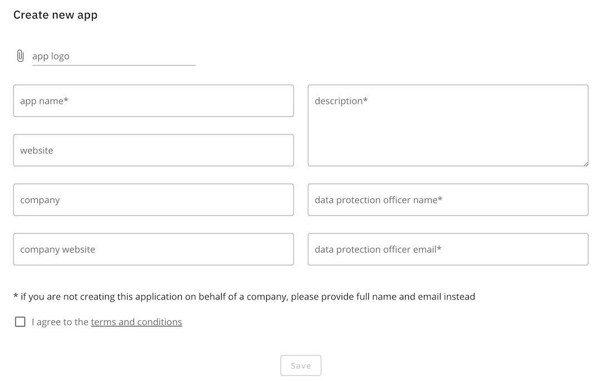
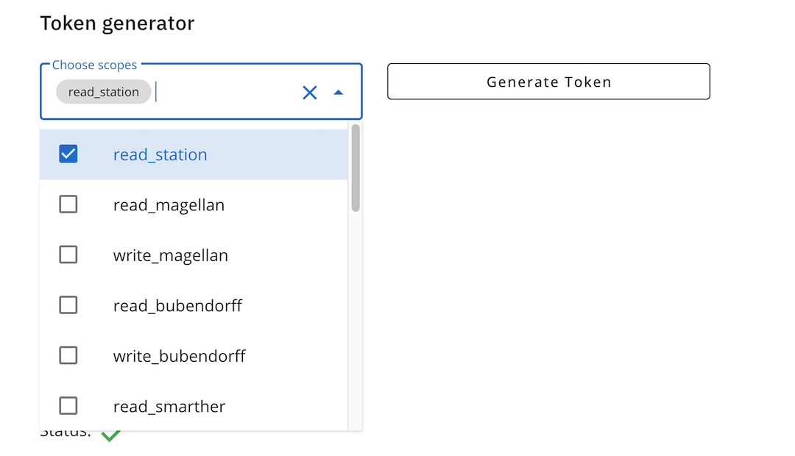
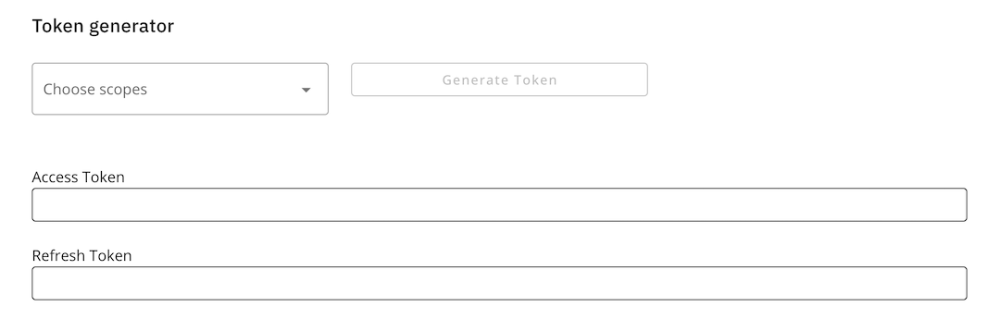
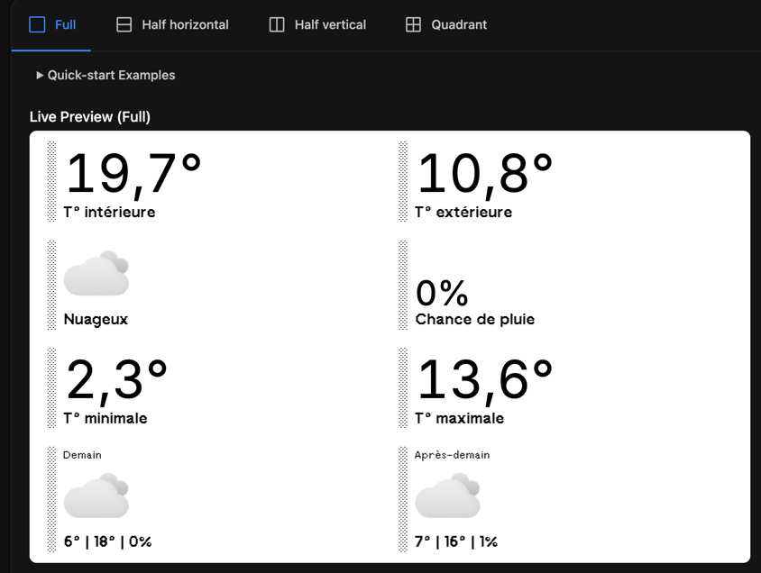
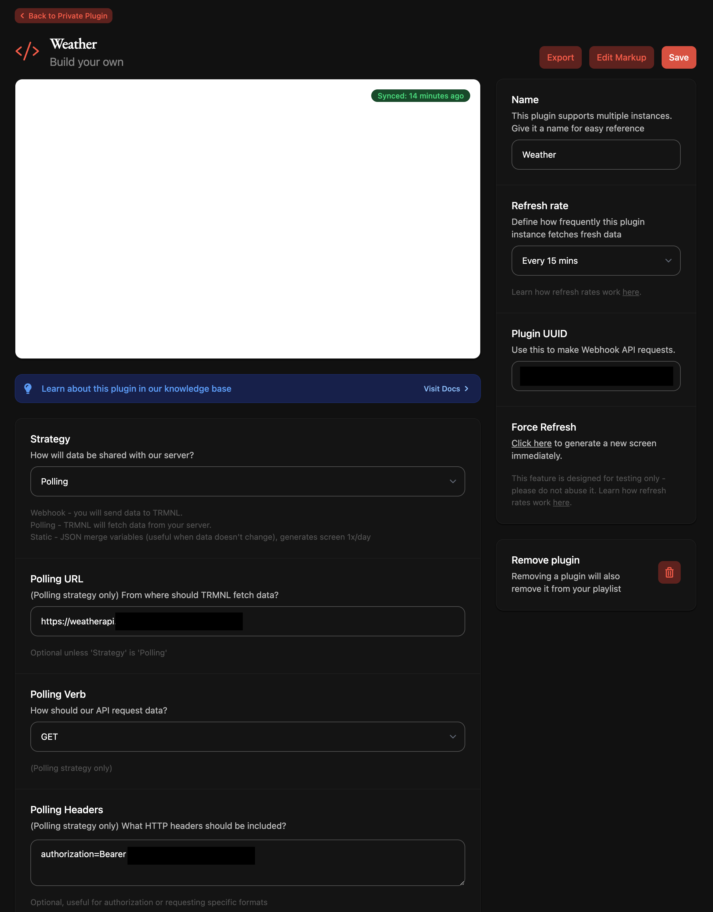

# Weather API

An API aggregating Netatmo devices and Tomorrow.io weather API

## Features

weather_api is lightweight Express JS API aggregating Netatmo weather stations data and Tomorrow.io weather API.  

It can be used to get Netatmo data, Tomorrow.io data or both, depending on the environment variables you set.

It provides an endpoint to deliver icons based on weather codes.  
It also provides weather code labels in english and french.

### Response example

Check the [example file](doc/response_example.json).

## Installation

The recommended way to deploy weather_api is docker compose. An example is available [here](docker-compose.yml).

Please follow the Configuration section of this documentation to set up the required environment variables.

## Configuration

### Netatmo API documentation

#### Authentication

In order for weather_api to retrieve data from your Netatmo weather station, you're going to need a client ID, a client secret and refresh token:

- Navigate to [Netatmo connect](https://dev.netatmo.com/) and login.
- Go to ["My apps"](https://dev.netatmo.com/apps/) (from the dropdown menu on the top right of the page)
- Create a new app, give it a name, a description, data protection officer name and email  
  
- Go to the app page and you'll find the client ID and the client secret in the "App Technical Parameters" section
- Just below, you'll find the "Token generator". Select "read_station" in the "Choose scopes" list and click on the "Generate Token" button.  
  
- Click on the "Yes, I accept" button on the next page.
- Copy the Refresh Token (and not the Access Token) and call weather_api with it: https://weatherapi.mydomain.com/?refresh_token=<refresh token>
  
- You should be redirected to https://weatherapi.mydomain.com/ and get your weather station data in the netatmo property of the JSON response.
- weather_api will store the refresh token in its `/app/data` folder.

#### Configuration

Here are the environment variables you should set for Netatmo: `NETATMO_CLIENT_ID` and `NETATMO_CLIENT_SECRET`.  
Either create a .env file and run `node -r dotenv/config index.js` or set those variables in your `docker-compose.yml` file.

### Tomorrow.io API documentation

#### Authentication

In order for weather_api to retrieve weather and forecast data, you're going to need a Tomorrow.io API key:

- Visit [Tomorrow.io](https://app.tomorrow.io/signin/) and sign up (or login)
- On the [following page](https://app.tomorrow.io/home), you should find your API Key at the top of the page.

#### Configuration

Here are the environment variables you should set for Tomorrow.io: `TOMORROW_IO_API_KEY`, `TOMORROW_IO_LOCATION` (your location, use https://app.tomorrow.io/map to find it) and `TOMORROW_IO_UNIT` (metric or imperial).  
Either create a .env file and run `node -r dotenv/config index.js` or set those variables in your `docker-compose.yml` file.

### Authentication

If you're not comfortable exposing your location and weather data, you can set the `AUTHENTICATION_TOKEN` environment variable. It will be required to access the https://weatherapi.mydomain.com/ URL. You'll have to use an `authentication` header:

```shell
curl -H "Authorization: Bearer <AUTHENTICATION_TOKEN>" https://weatherapi.mydomain.com/
```

## TRMNL template example

This project was originally started to feed data to a [TRMNL](https://usetrmnl.com/) plugin.



Use these settings for your TRMNL Private Plugin:



And this Markup source code:

```html
<div class="layout">
  <div class="grid grid--cols-2 gap--large">
    <div class="item">
      <div class="meta"></div>
      <div class="content">
        <span class="value value--large value--tnums"
          >{{ netatmo[0].dashboard_data.Temperature | number_with_delimiter: ' ', ','}}°</span
        >
        <span class="label label--medium">T° intérieure</span>
      </div>
    </div>
    <div class="item">
      <div class="meta"></div>
      <div class="content">
        <span class="value value--large value--tnums"
          >{{ netatmo[0].modules[0].dashboard_data.Temperature | number_with_delimiter: ' ', ','}}°</span
        >
        <span class="label label--medium">T° extérieure</span>
      </div>
    </div>
    <div class="item">
      <div class="meta"></div>
      <div class="content">
        
        <span class="value value--medium"
          ></span>
        <span class="label label--medium">{{ weatherCodes.fr[weatherCode] }}</span>
      </div>
    </div>
    <div class="item">
      <div class="meta"></div>
      <div class="content">
        <span class="value value--medium"
          >{{ forecast.timelines.daily[0].values.precipitationProbabilityAvg | number_with_delimiter: ' ', ',' }}%</span
        >
        <span class="label label--medium">Chance de pluie</span>
      </div>
    </div>
    <div class="item">
      <div class="meta"></div>
      <div class="content">
        <span class="value value--large value--tnums"
          >{{ forecast.timelines.daily[0].values.temperatureMin | number_with_delimiter: ' ', ','}}°</span
        >
        <span class="label label--medium">T° minimale</span>
      </div>
    </div>
    <div class="item">
      <div class="meta"></div>
      <div class="content">
        <span class="value value--large value--tnums"
          >{{ forecast.timelines.daily[0].values.temperatureMax | number_with_delimiter: ' ', ','}}°</span
        >
        <span class="label label--medium">T° maximale</span>
      </div>
    </div>
    <div class="item">
      <div class="meta"></div>
      <div class="content">
        
        <span class="label label--small">Demain</span>
        <span class="value value--medium"
          ></span>
        <span class="label label--medium">
          {{ forecast.timelines.daily[1].values.temperatureMin | round | number_with_delimiter: ' ', ','}}° | {{
          forecast.timelines.daily[1].values.temperatureMax | round | number_with_delimiter: ' ', ','}}° | {{
          forecast.timelines.daily[1].values.precipitationProbabilityAvg | round | number_with_delimiter: ' ', ','}}%
        </span>
      </div>
    </div>
    <div class="item">
      <div class="meta"></div>
      <div class="content">
        
        <span class="label label--small">Après-demain</span>
        <span class="value value--medium"
          ></span>
        <span class="label label--medium">
          {{ forecast.timelines.daily[2].values.temperatureMin | round | number_with_delimiter: ' ', ','}}° | {{
          forecast.timelines.daily[2].values.temperatureMax | round | number_with_delimiter: ' ', ','}}° | {{
          forecast.timelines.daily[2].values.precipitationProbabilityAvg | round | number_with_delimiter: ' ', ','}}%
        </span>
      </div>
    </div>
  </div>
</div>
```

## License

MIT

Copyright 2025 - Simon Jodet

Permission is hereby granted, free of charge, to any person obtaining a copy of this software and associated documentation files (the “Software”), to deal in the Software without restriction, including without limitation the rights to use, copy, modify, merge, publish, distribute, sublicense, and/or sell copies of the Software, and to permit persons to whom the Software is furnished to do so, subject to the following conditions:

The above copyright notice and this permission notice shall be included in all copies or substantial portions of the Software.

THE SOFTWARE IS PROVIDED “AS IS”, WITHOUT WARRANTY OF ANY KIND, EXPRESS OR IMPLIED, INCLUDING BUT NOT LIMITED TO THE WARRANTIES OF MERCHANTABILITY, FITNESS FOR A PARTICULAR PURPOSE AND NONINFRINGEMENT. IN NO EVENT SHALL THE AUTHORS OR COPYRIGHT HOLDERS BE LIABLE FOR ANY CLAIM, DAMAGES OR OTHER LIABILITY, WHETHER IN AN ACTION OF CONTRACT, TORT OR OTHERWISE, ARISING FROM, OUT OF OR IN CONNECTION WITH THE SOFTWARE OR THE USE OR OTHER DEALINGS IN THE SOFTWARE.

## Thanks to

Tomorrow.io for their [weather data](https://www.tomorrow.io/weather-api/) and [icons](https://github.com/Tomorrow-IO-API/tomorrow-weather-codes).
